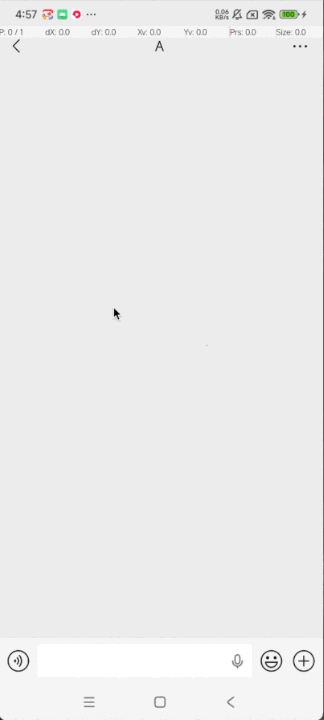

**Naughtykids** 一款预防淘气的孩子乱花钱的APP

# 背景

最近几年，不少孩子偷偷用手机来打赏主播、乱发红包、购买玩具，给家长造成了莫名其妙的财产损失，**Naughtykids**就是用来预防淘气孩子乱花钱的APP。

# 简介

通过无障碍服务，监听Android手机上的页面变化，当发现淘气孩子乱花钱的行为时，**Naughtykids**会自动在生成一个透明全屏悬浮窗，拦截淘气孩子进行下一步操作，以预防淘气孩子乱花钱。

# 示例

| 微信红包 | 微信直播 | 禁止网购App启动 | 禁止直播打赏 |
| :----------: | :----------: | :----------: | :----------: |
|  |  |  |  |

# License

Copyright 2026 &copy; 剑指漠北

Dual licensed under the terms of [Apache-2.0 license](https://www.apache.org/licenses/LICENSE-2.0.html). 
